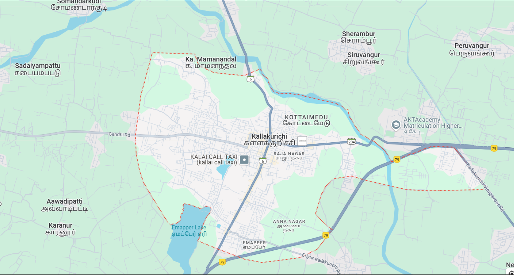
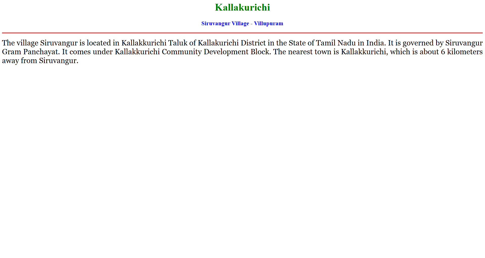
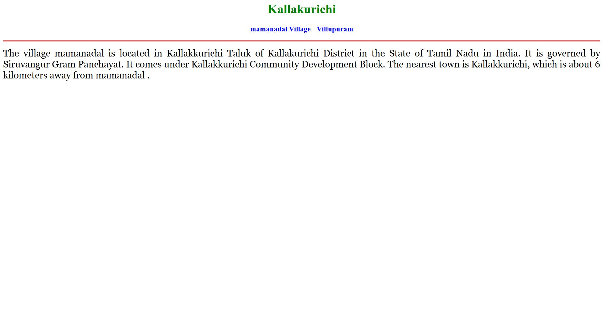
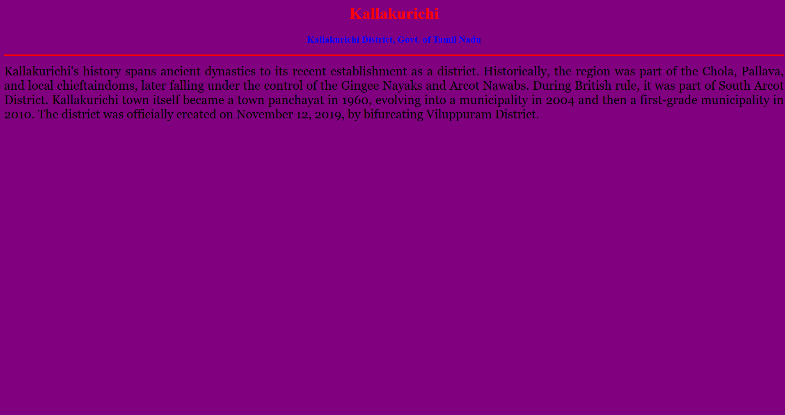
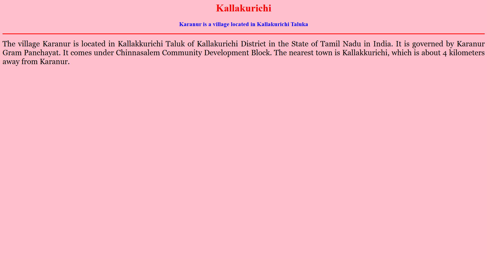

# Ex04 Places Around Me
## Date:13-4-2025
# AIM
To develop a website to display details about the places around my house.

# DESIGN STEPS
## STEP 1
Create a Django admin interface.

## STEP 2
Download your city map from Google.

## STEP 3
Using <map> tag name the map.

## STEP 4
Create clickable regions in the image using <area> tag.

## STEP 5
Write HTML programs for all the regions identified.

## STEP 6
Execute the programs and publish them.

# CODE
```
map.html

<!DOCTYPE html>
<html lang="en">
<head>
    <meta charset="UTF-8">
    <meta name="viewport" content="width=device-width, initial-scale=1.0">
    <title>Document</title>
</head>
<body>
    <div class="container">
        <div class="container">
<!-- Image Map Generated by http://www.image-map.net/ -->


<map name="image-map">
    <area target="" alt="kallakurichi" title="kallakurichi" href="home.html" coords="1276,468,152" shape="circle">
    <area target="" alt="karanur" title="karanur" href="karanur.html" coords="513,712,98" shape="circle">
    <area target="" alt="mamanandal" title="mamanandal" href="maman.html" coords="945,220,131" shape="circle">
    <area target="" alt="siruvangur" title="siruvangur" href="siruvangur.html" coords="1405,220,133" shape="circle">
</map>
</map>
        </div> 
    </div>
</body>
</html>

siruvangur.html

<html> 
<head> 
<title>My Home Town</title> 
</head> 
<body bgcolor="white"> 
<h1 align="center"> 
<font color="green"><b>Kallakurichi</b></font> 
</h1> 
<h3 align="center"> 
<font color="blue"><b>Siruvangur Village - Villupuram</b></font> 
</h3> 
<hr size="3" color="red"> 
<p align="justify"> 
<font face="Georgia" size="5"> 
The village Siruvangur is located in Kallakkurichi Taluk of Kallakurichi District
 in the State of Tamil Nadu in India. It is governed by Siruvangur Gram Panchayat. 
 It comes under Kallakkurichi Community Development Block. The nearest town is Kallakkurichi,
  which is about 6 kilometers away from Siruvangur.
</p> 
</body> 
</html>

maman.html

<html> 
<head> 
<title>mamanadal</title> 
</head> 
<body bgcolor="white"> 
<h1 align="center"> 
<font color="green"><b>Kallakurichi</b></font> 
</h1> 
<h3 align="center"> 
<font color="blue"><b>mamanadal Village - Villupuram</b></font> 
</h3> 
<hr size="3" color="red"> 
<p align="justify"> 
<font face="Georgia" size="5"> 
The village mamanadal  is located in Kallakkurichi Taluk of Kallakurichi District
 in the State of Tamil Nadu in India. It is governed by Siruvangur Gram Panchayat. 
 It comes under Kallakkurichi Community Development Block. The nearest town is Kallakkurichi,
  which is about 6 kilometers away from mamanadal .
</p> 
</body> 
</html>

karanur.html

<html> 
<head> 
<title>My Home Town</title> 
</head> 
<body bgcolor="pink"> 
<h1 align="center"> 
<font color="red"><b>Kallakurichi</b></font> 
</h1> 
<h3 align="center"> 
<font color="blue"><b>Karanur is a village located in Kallakurichi Taluka</b></font> 
</h3> 
<hr size="3" color="red"> 
<p align="justify"> 
<font face="Georgia" size="5"> 
The village Karanur is located in Kallakkurichi Taluk of Kallakurichi District in the State of Tamil Nadu in India. 
It is governed by Karanur Gram Panchayat. It comes under Chinnasalem Community Development Block. 
The nearest town is Kallakkurichi, which is about 4 kilometers away from Karanur.
</p> 
</body> 
</html>

```
# OUTPUT





# RESULT
The program for implementing image maps using HTML is executed successfully.
